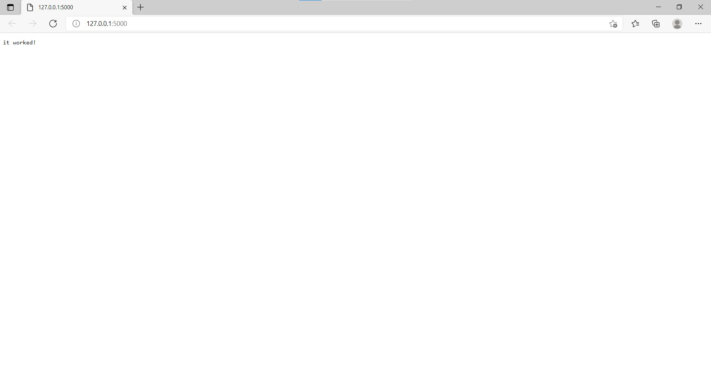
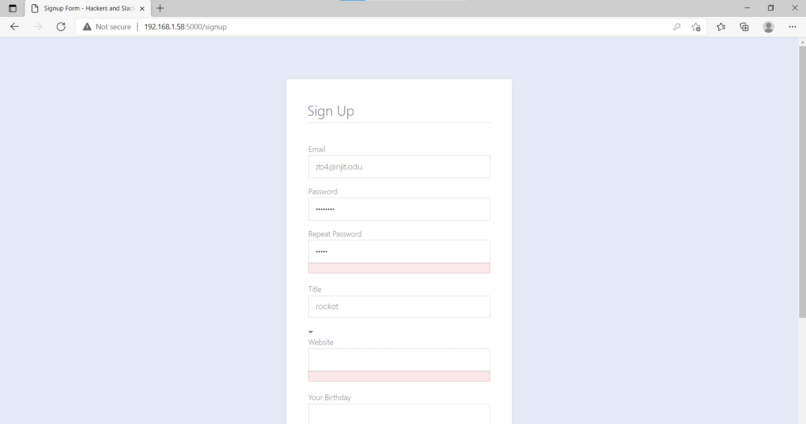

# Steps Screenshots
# Step I - Creating Your First Flask Application - hello world and key-value pair page works

# step II - Rendering Pages in Flask Using Jinja -demo page works

# step III - Handling Forms in Flask with Flask-WTF

# step IV - The Art of Routing in Flask- error handling page works

# step V - Configuring Your Flask App - page with updated configuration works

# step VI-VIII -Compiling Frontend JavaScript & Stylesheets Flask 

# step IX - Connect Flask to a Database with Flask-SQLAlchemy - database works

# step X - Handle User Accounts & Authentication in Flask with Flask-Login

# step XI - Managing Session Data with Flask-Session & Redis

